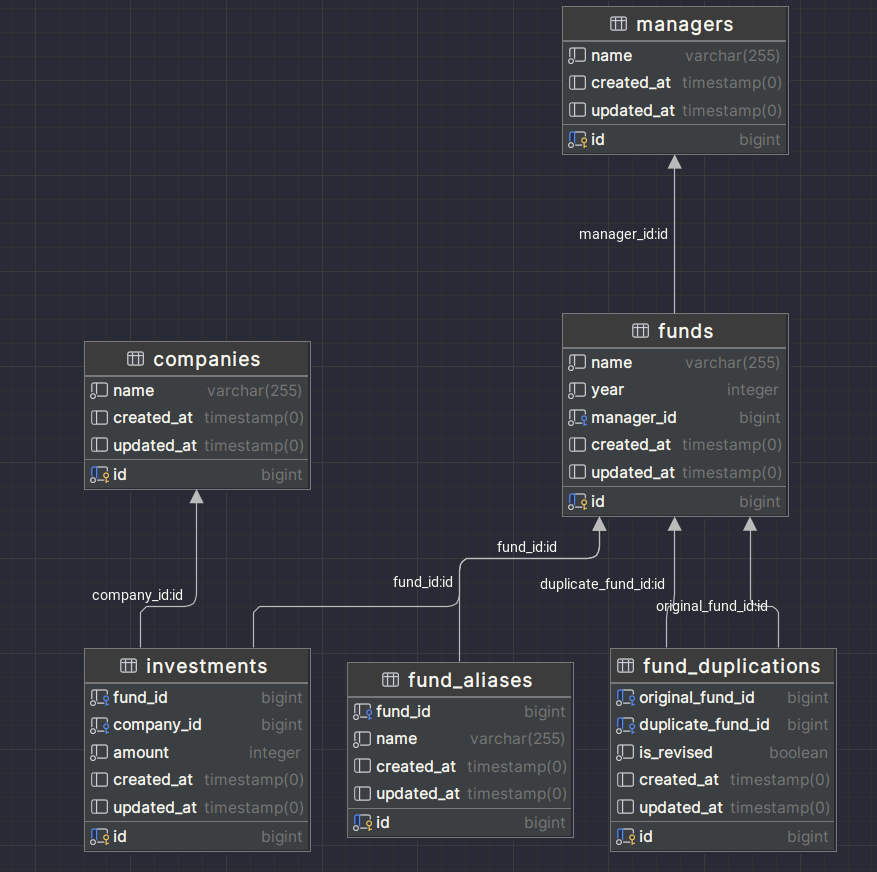

### Project Overview
This Laravel-based solution for Canoe Tech's assessment is designed to manage investment fund data efficiently. It incorporates a robust data model, back-end services, and event-driven processes for fund records, their managers, and associated entities.

### Getting Started

#### Requirements
- Docker
- Composer

#### Installation
1. Clone the repository.
2. The project comes with a `.env` file pre-configured for a quick setup. This approach helps in standardizing the environment for all developers and speeds up the initial setup process.
3. Run `./vendor/bin/sail composer install` to install PHP dependencies.


### Project Structure
- **app/UseCases/Fund**: Contains business logic related to fund management.
- **database/migrations**: Migration files for the database schema.
- **tests/Feature**: Tests for application functionality.

### Features and Requirements Addressed
- **Data Model (Done in database/migrations)**: Custom-designed schema for managing funds, fund managers, companies, and related data.
- **Event-Driven Duplicate Detection (Done in app/Events)**: Detects and manages duplicate fund records.
- **Scalability Considerations (Addressed in app/Providers)**: Optimized for large datasets and concurrent users.
- **Testing (Done in tests/)**: Comprehensive test suite for robust application functionality.
- **Code Quality (Reflected throughout the project)**: Adherence to DRY, KISS, SOLID principles and clear separation of concerns.

### Testing
Run the following command to execute the tests:
```
./vendor/bin/sail artisan test
```

## ER Diagram
The ER diagram is like the image below:

